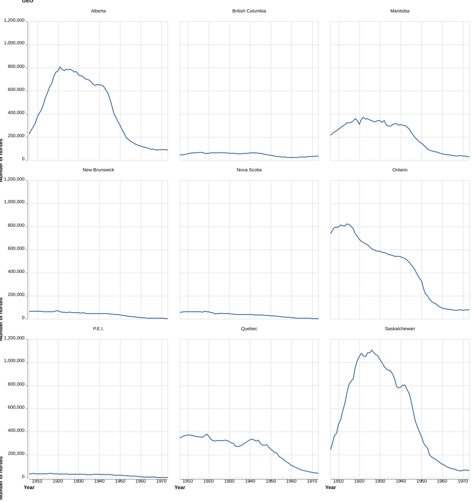
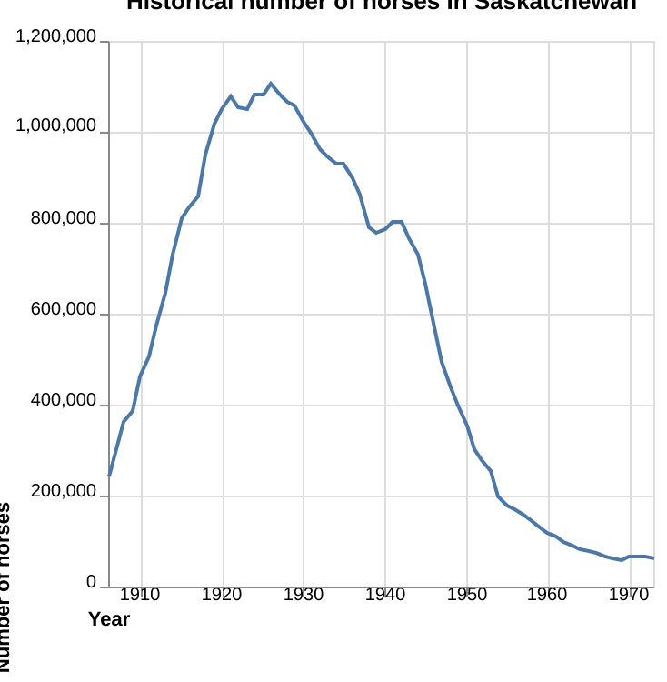

```{python}

import pandas as pd
from IPython.display import Markdown, display
from tabulate import tabulate
```

# Aim

This project explores the historical population of horses in Canada between 1906 and 1972 for each province.

# Data

Horse population data were sourced from the 
[Government of Canada's Open Data website](http://open.canada.ca/en/open-data) 
(Government of Canada, 2017a and Government of Canada, 2017b).

# Methods

The Python programming language (Van Rossum and Drake 2009)
and the following Python packages were used to perform the analysis: 
pandas (McKinney 2010), altair (VanderPlas 2018), click (Team 2020), 
as well as Quarto (Allaire et al. 2022). 
*Note: this report is adapted from Timbers (2020).* 

# Results

{#fig-horse-pop width=60%}

As shown in @fig-horse-pop, Ontario, Saskatchewan, and Alberta have had the highest horse populations.
All provinces have had a decline in horse populations since 1940. 
This is likely due to the rebound of the Canadian automotive industry 
after the Great Depression and the Second World War. 
An interesting follow-up visualisation would be car sales per year 
for each Province over the time period visualised above 
to further support this hypothesis.

Suppose we were interested in looking in more closely at the province 
with the highest spread (in terms of standard deviation) of horse populations. 
We present the standard deviations in Table 1.

```{python}
#| label: tbl-horse-sd
#| tbl-cap: Standard deviation of historical (1906-1972) horse populations for each Canadian province.
horses_sd_table = pd.read_csv("../results/horses_sd.csv")
largest_sd = horses_sd_table['Province'].values[0]
Markdown(horses_sd_table.to_markdown(index = False))
```

Note that we define standard deviation (of a sample) as

$$s = \sqrt{\frac{\sum_{i=1}^N (x_i - \overline{x})^2}{N-1} }$$


As shown in @tbl-horse-sd, `{python} largest_sd` had the largest spread in horse population values.

Additionally, note that in @tbl-horse-sd we consider the sample standard deviation of the number of horses during the same time span as @fig-horse-pop.

{#fig-largest-sd width=60% fig-pos=H}

In @fig-largest-sd, we zoom in on `{python} largest_sd`, which had the largest spread of horse population values.

# References
Horse population data were sourced from the
[Government of Canada's Open Data website](http://open.canada.ca/en/open-data) [@horses1; @horses2]

Quarto documentation was sourced from 
[Quarto-cli Github Page](https://github.com/quarto-dev/quarto-cli) [@Allaire_Quarto_2022]

Altair was sourced from 
[Altair: Interactive Statistical Visualizations for Python](https://joss.theoj.org/papers/10.21105/joss.01057) [@altair]

Click Documentation was sourced from 
[Click Documentation Page](https://click.palletsprojects.com/) [@click]

Pandas Documentation
[@pandas]

equine_numbers_value_canada_parameters Github Page
[equine_numbers_value_canada_parameters Github Page](https://github.com/ttimbers/equine_numbers_value_canada_parameters) [@ttimbers-horses]

Knitr Documentation was sourced from 
[Implementing Reproducible Research](http://www.crcpress.com/product/isbn/9781466561595) [@knitr]


